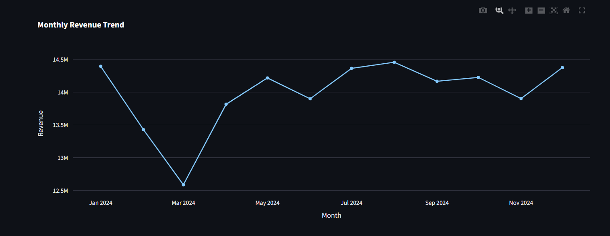
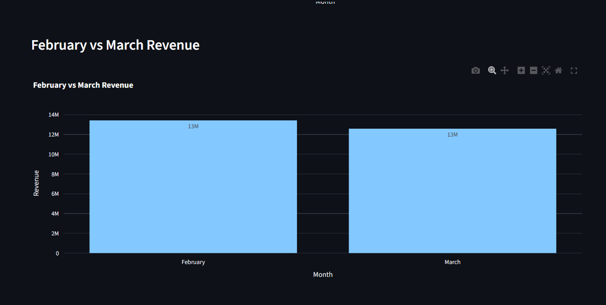
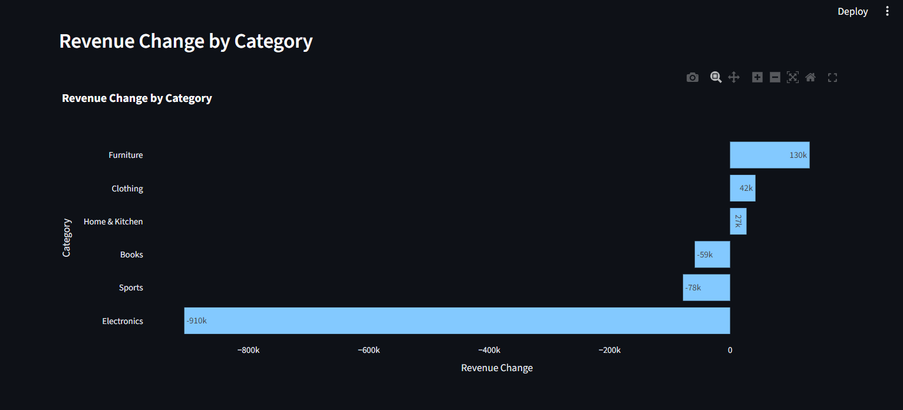
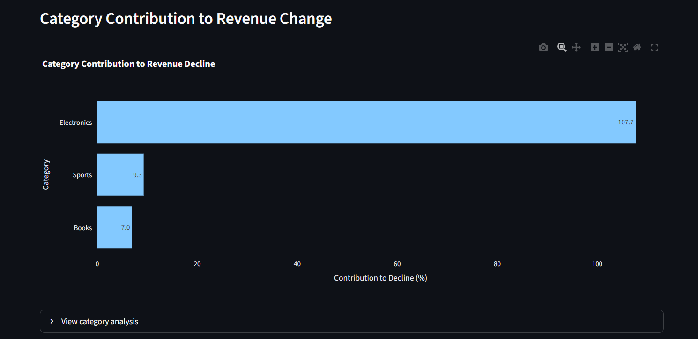
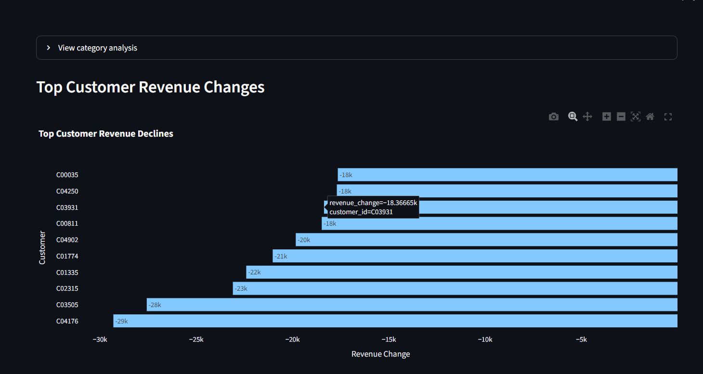
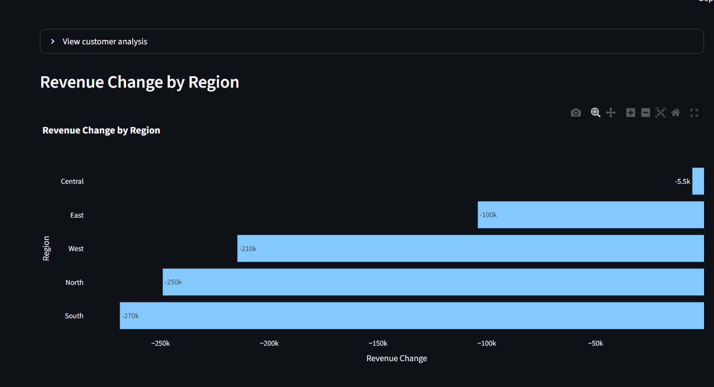

# AI Business Analyst 📊

> An end-to-end AI-powered business analytics application that converts natural-language business questions into SQL, performs automated analysis, generates insights, and creates interactive visualizations.

## 🚀 Demo
1. Spot the problem: monthly trend

2. Quantify the drop: February vs March

3. Find the cause: category breakdown

4. Drill down: customers and regions

Ask:

> "Why did revenue drop in March?"

The application automatically:

1. Generates analytical SQL
2. Validates the SQL
3. Queries the business database
4. Performs Python/Pandas analysis
5. Identifies key contributors
6. Generates business insights
7. Creates interactive visualizations
## 🛠️ Tech Stack

- Python
- SQL
- SQLite
- Pandas
- NumPy
- OpenAI API
- LangChain
- Plotly
- Streamlit
- Pytest
- Git/GitHub
